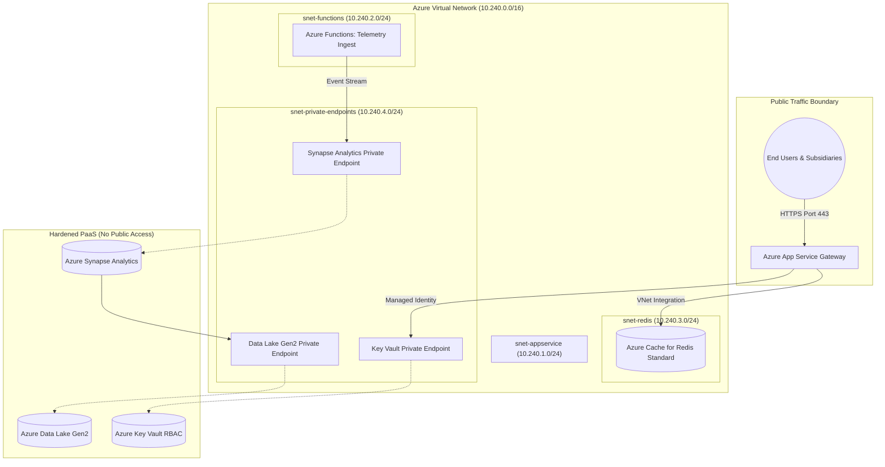

# Enterprise Azure Cloud Platform & DevSecOps Infrastructure as Code (IaC)

[](https://azure.microsoft.com/)
[](https://learn.microsoft.com/azure/azure-resource-manager/bicep/)
[](https://azure.microsoft.com/products/cache/)
[](https://azure.microsoft.com/products/synapse-analytics/)
[](security_audit/pre_production_security_checklist.md)
[](LICENSE)
[](https://github.com/JayNabasu)

Production-grade **Azure Infrastructure as Code (Bicep)** and DevSecOps architecture provisioning a hardened enterprise foundation for subsidiary digital platforms and the Enterprise Data Warehouse (EDW). Built to **Zero Trust (CAF)** principles, it automates the deployment of **Azure App Service, Serverless Functions, Managed Redis, Key Vault, and Azure Synapse Analytics** with strict private endpoint isolation.

---

## Architectural Highlights

- **Zero-Trust Network Perimeter**: Virtual Network (VNet) topology with dedicated subnets for App Service, Function Apps, and Managed Redis. Backend PaaS resources enforce `publicNetworkAccess: 'Disabled'`.
- **System-Assigned Managed Identity**: Eliminates hardcoded service principal credentials and API keys. Applications authenticate to Azure Key Vault and Storage Blobs using Azure AD RBAC.
- **Enterprise PaaS & Data Services**:
  - **Azure App Service (Linux P1v3)**: High-availability web hosting with regional VNet injection, HTTP/2, and TLS 1.2.
  - **Azure Functions (Elastic Premium)**: Event-driven SCADA and telemetry ingestion pipelines.
  - **Azure Cache for Managed Redis**: High-throughput distributed caching with SSL-only connectivity.
  - **Azure Synapse Analytics & Data Lake Gen2**: Scalable dimensional Enterprise Data Warehouse with hierarchical namespace storage.
- **Pre-Production Security Auditing**: Includes a comprehensive [Pre-Production Security Checklist](security_audit/pre_production_security_checklist.md) adhering to ISO/IEC 27001 standards.

---

## Architecture Topology



---

## Repository Structure

```text
azure-enterprise-cloud-platform-iac/
├── bicep/
│   ├── main.bicep                     # Master deployment orchestrator
│   ├── parameters.json                # Environment configuration values
│   └── modules/
│       ├── network.bicep              # VNet, Subnets, and NSG rules
│       ├── keyvault.bicep             # Key Vault with RBAC authorization
│       ├── redis.bicep                # Azure Cache for Redis (Standard)
│       ├── appservice.bicep           # Linux App Service & VNet integration
│       ├── functions.bicep            # Serverless Function App & Storage
│       └── synapse.bicep              # Synapse Workspace & ADLS Gen2
├── security_audit/
│   └── pre_production_security_checklist.md # Zero-trust audit checklist
├── .github/workflows/
│   └── ci.yml                         # Automated Bicep build & Checkov linting
├── .gitignore
└── README.md
```

---

## Deployment & Verification

### 1. Pre-Deployment Bicep Compilation & What-If
Validate syntax and preview Azure resource creation:
```powershell
az bicep build --file bicep/main.bicep

az deployment group what-if `
  --resource-group rg-nnpc-energy-prod `
  --template-file bicep/main.bicep `
  --parameters bicep/parameters.json
```

### 2. Execute Infrastructure Provisioning
```powershell
az deployment group create `
  --resource-group rg-nnpc-energy-prod `
  --template-file bicep/main.bicep `
  --parameters bicep/parameters.json
```

---

## Author & Contact

**Jerry A. Nabasu**  
- **Role**: Automation & Digital Innovation Professional  
- **Certifications**: GInI Certified Innovation Strategist (CInS), Azure Data Engineering (2024)  
- **Directorate**: Research, Technology & Innovation (RTI), NNPC Limited  
- **GitHub**: [@JayNabasu](https://github.com/JayNabasu)  
- **Email**: [jerrynabasu@gmail.com](mailto:jerrynabasu@gmail.com)
